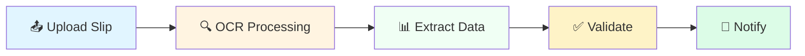
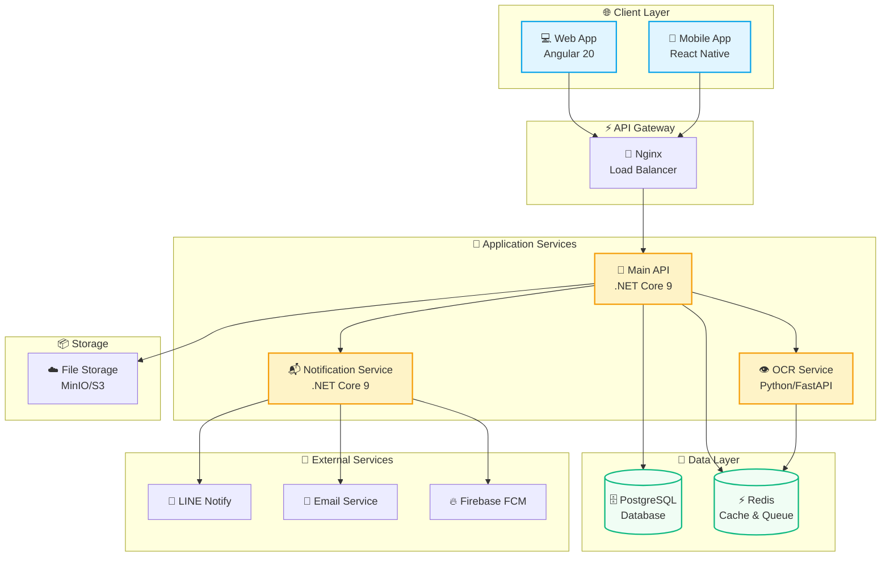
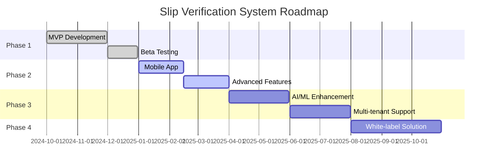

<div align="center">

# 💳 Slip Verification System

### ระบบตรวจสอบการรับชำระเงินผ่าน QR Code แบบอัตโนมัติด้วย AI

[](https://github.com/yourusername)
[](LICENSE)
[](CONTRIBUTING.md)

---

### 🚀 Technology Stack

[](https://dotnet.microsoft.com/)
[](https://angular.io/)
[](https://www.postgresql.org/)
[](https://www.python.org/)
[](https://www.typescriptlang.org/)
[](https://www.docker.com/)
[](https://redis.io/)

---

<p align="center">
  <a href="#-quick-start">Quick Start</a> •
  <a href="#-features">Features</a> •
  <a href="#-demo">Demo</a> •
  <a href="#-documentation">Documentation</a> •
  <a href="#-api-reference">API</a> •
  <a href="#-contributing">Contributing</a>
</p>


</div>

---

## 🎯 About The Project

> **Automate slip verification, eliminate manual checking, and get real-time payment notifications!**

Slip Verification System เป็นระบบตรวจสอบและยืนยันการชำระเงินผ่าน QR Code แบบอัตโนมัติ โดยใช้เทคโนโลジี **OCR (Optical Character Recognition)** ในการอ่านข้อมูลจากสลิปการโอนเงิน และส่งการแจ้งเตือนแบบ **Real-time** ผ่านหลายช่องทาง

<div align="center">

### 📊 Why This System?

| ❌ **Before** (Manual) | ✅ **After** (Automated) |
|:---|:---|
| ⏱️ ใช้เวลา 5-10 นาทีต่อการตรวจสอบ 1 สลิป | ⚡ ตรวจสอบอัตโนมัติภายใน 3 วินาที |
| 👤 เสี่ยงผิดพลาดจากคนตรวจสอบ | 🤖 ความแม่นยำ 95%+ ด้วย AI |
| 📝 ต้องบันทึกข้อมูลด้วยตนเอง | 💾 บันทึกอัตโนมัติและสร้างรายงาน |
| 📞 แจ้งลูกค้าทีละคน | 🔔 แจ้งเตือนทันที (LINE, Email, Push) |
| 📂 จัดการเอกสารยาก | 🗄️ ระบบจัดเก็บและค้นหาที่มีประสิทธิภาพ |

</div>


<br/>

### 📸 Application Preview

<table>
<tr>
<td width="50%">

#### 📊 Real-time Dashboard

<sub>แสดงสถิติและกราฟแบบ Real-time</sub>

</td>
<td width="50%">

#### 📤 Slip Upload Interface

<sub>Drag & Drop ง่าย พร้อม Preview</sub>

</td>
</tr>
<tr>
<td width="50%">

#### ✅ Verification Result

<sub>แสดงผลการตรวจสอบพร้อม Confidence Score</sub>

</td>
<td width="50%">

#### 📱 Mobile Application

<sub>ใช้งานได้ทั้ง iOS และ Android</sub>

</td>
</tr>
</table>

---

## ⭐ Key Features

<details open>
<summary><b>🤖 Smart OCR & Verification</b></summary>
<br/>



- ✨ **อัพโหลดสลิป**: Drag & Drop, รองรับ JPG/PNG/PDF
- 🔍 **OCR Accuracy**: ความแม่นยำ 95%+ ด้วย PaddleOCR
- 📋 **Auto Extract**: จำนวนเงิน, วันที่, เวลา, เลขอ้างอิง, ธนาคาร
- ✅ **Smart Validation**: ตรวจสอบความถูกต้องและจับคู่กับ Order
- 🚫 **Duplicate Detection**: ตรวจจับสลิปซ้ำอัตโนมัติ

</details>

<details>
<summary><b>🔔 Multi-Channel Notifications</b></summary>
<br/>

<table>
<tr>
<th>Channel</th>
<th>Features</th>
<th>Speed</th>
</tr>
<tr>
<td> <b>LINE Notify</b></td>
<td>✅ Rich Messages<br/>✅ Images Support<br/>✅ Group Notifications</td>
<td>⚡ Instant</td>
</tr>
<tr>
<td> <b>Email</b></td>
<td>✅ HTML Templates<br/>✅ Attachments<br/>✅ Bounce Handling</td>
<td>⚡ < 5 seconds</td>
</tr>
<tr>
<td> <b>Push Notification</b></td>
<td>✅ iOS & Android<br/>✅ Deep Linking<br/>✅ Badge Updates</td>
<td>⚡ Real-time</td>
</tr>
<tr>
<td> <b>SMS (Optional)</b></td>
<td>✅ OTP Verification<br/>✅ Critical Alerts</td>
<td>⚡ < 10 seconds</td>
</tr>
</table>

</details>

<details>
<summary><b>📊 Advanced Dashboard & Analytics</b></summary>
<br/>

> Real-time insights with beautiful visualizations

**📈 Statistics Cards**
- 💰 Total Transactions & Revenue
- ✅ Success Rate
- ⏱️ Average Processing Time
- 🔄 Pending Payments Count

**📊 Interactive Charts**
- 📉 Transaction Timeline (Line Chart)
- 🥧 Payment Methods Distribution (Pie Chart)
- 📊 Monthly Comparison (Bar Chart)
- 🗓️ Calendar Heatmap

**🎯 Features**
- ⚡ Real-time Updates via WebSocket
- 📅 Date Range Filtering
- 📥 Export to Excel/PDF
- 📱 Responsive Design

</details>

<details>
<summary><b>🔐 Security & Compliance</b></summary>
<br/>

| Feature | Implementation | Status |
|---------|---------------|--------|
| 🔑 Authentication | JWT + Refresh Token | ✅ |
| 👮 Authorization | Role-Based Access Control | ✅ |
| 🔒 Data Encryption | AES-256 (at rest & transit) | ✅ |
| 🛡️ Input Validation | FluentValidation | ✅ |
| 🚫 SQL Injection | Parameterized Queries | ✅ |
| 🌐 XSS Protection | Content Security Policy | ✅ |
| 📝 Audit Trail | Complete Activity Logs | ✅ |
| 🇹🇭 PDPA Compliant | Data Protection Act | ✅ |

</details>

<details>
<summary><b>🚀 Performance & Scalability</b></summary>
<br/>

```
📊 Performance Metrics:
├─ 🎯 Response Time: < 200ms (GET requests)
├─ ⚡ Slip Processing: < 3 seconds
├─ 🔄 Concurrent Users: 1,000+
├─ 📈 Daily Transactions: 10,000+
└─ 💾 Database Size: Supports Millions of Records
```

**🎨 Optimization Techniques:**
- ⚡ Redis Caching
- 🔄 Database Indexing
- 📦 Response Compression
- 🎭 Lazy Loading
- 🚀 CDN Integration
- ⚖️ Load Balancing
- 📊 Auto-Scaling (Kubernetes)

</details>

<details>
<summary><b>📱 Multi-Platform Support</b></summary>
<br/>

<div align="center">

| Platform | Technology | Status |
|:--------:|:-----------|:------:|
| 🌐 **Web** | Angular 20 + Tailwind CSS | ✅ Production |
| 📱 **iOS** | React Native | ✅ Beta |
| 🤖 **Android** | React Native | ✅ Beta |
| 💻 **Desktop** | Electron (Planned) | 🔄 Roadmap |
| 🌙 **Dark Mode** | All Platforms | ✅ |
| 🌍 **i18n** | Thai, English | ✅ |

</div>

</details>

---

## 🏗️ System Architecture

<div align="center">

### 🎨 High-Level Architecture



<sub>🔄 Real-time data flow | 🔐 Secure communication | ⚡ High performance</sub>

</div>

---

## 🚀 Quick Start

<div align="center">

### 🎯 Get Started in 3 Steps

</div>

<table>
<tr>
<td width="33%" align="center">

### 1️⃣ Clone
```bash
git clone https://github.com/yourusername/slip-verification-system.git
cd slip-verification-system
```

</td>
<td width="33%" align="center">

### 2️⃣ Configure
```bash
cp .env.example .env
# Edit .env file
```

</td>
<td width="33%" align="center">

### 3️⃣ Launch
```bash
make dev
# or
docker-compose up -d
```

</td>
</tr>
</table>

<br/>

<div align="center">

### 🎮 Quick Commands

[](Makefile)
[](Makefile)
[](Makefile)
[](docs/)

</div>

> **💡 Pro Tip**: ใช้ `make help` เพื่อดูคำสั่งทั้งหมด

<br/>

### 📦 Installation Options

<details>
<summary><b>🐳 Option 1: Docker (Recommended)</b></summary>

```bash
# เริ่มต้นทุก services ด้วย Docker Compose
docker-compose up -d

# รัน migrations
docker-compose exec api dotnet ef database update

# ✅ Ready! เข้าใช้งานได้ที่:
# 🌐 Frontend: http://localhost:4200
# 🔧 API: http://localhost:5000
# 📖 Swagger: http://localhost:5000/swagger
```

</details>

<details>
<summary><b>💻 Option 2: Local Development</b></summary>

**Prerequisites:**
- .NET SDK 9.0+
- Node.js 20+
- PostgreSQL 16+
- Redis 7+
- Python 3.12+

**Backend:**
```bash
cd src/backend/SlipVerification.API
dotnet restore
dotnet ef database update
dotnet run
```

**Frontend:**
```bash
cd src/frontend/slip-verification-web
npm install
ng serve
```

**OCR Service:**
```bash
cd src/services/ocr-service
python -m venv venv
source venv/bin/activate
pip install -r requirements.txt
uvicorn app.main:app --reload
```

</details>

<details>
<summary><b>☸️ Option 3: Kubernetes (Production)</b></summary>

```bash
# Apply all manifests
kubectl apply -f infrastructure/kubernetes/

# Check status
kubectl get pods
kubectl get services

# Access via ingress
# https://yourdomain.com
```

</details>

<br/>

### 🌐 Access Points

<div align="center">

| Service | URL | Status |
|:--------|:----|:------:|
| 🌐 **Web App** | http://localhost:4200 | [](http://localhost:4200) |
| 🔧 **API** | http://localhost:5000 | [](http://localhost:5000) |
| 📖 **Swagger UI** | http://localhost:5000/swagger | [](http://localhost:5000/swagger) |
| 📚 **ReDoc** | http://localhost:5000/redoc | [](http://localhost:5000/redoc) |
| 🤖 **OCR Service** | http://localhost:8000 | [](http://localhost:8000) |
| 🐰 **RabbitMQ** | http://localhost:15672 | [](http://localhost:15672) |
| 💾 **MinIO** | http://localhost:9001 | [](http://localhost:9001) |
| 🗄️ **pgAdmin** | http://localhost:5050 | [](http://localhost:5050) |

</div>

---

## 🛠️ Technology Stack

<div align="center">

### 🎯 Core Technologies

#### Backend Stack
[](https://dotnet.microsoft.com/)
[](https://learn.microsoft.com/en-us/dotnet/csharp/)
[](https://learn.microsoft.com/en-us/ef/)

#### Frontend Stack
[](https://angular.io/)
[](https://www.typescriptlang.org/)
[](https://tailwindcss.com/)
[](https://material.angular.io/)

#### Database & Cache
[](https://www.postgresql.org/)
[](https://redis.io/)

#### OCR & AI
[](https://www.python.org/)
[](https://fastapi.tiangolo.com/)
[](https://github.com/PaddlePaddle/PaddleOCR)

#### DevOps
[](https://www.docker.com/)
[](https://kubernetes.io/)
[](https://github.com/features/actions)
[](https://nginx.org/)

</div>

<br/>

<details>
<summary><b>📦 Complete Dependency List</b></summary>

#### Backend Dependencies
```
├── MediatR (12.0) - CQRS Pattern
├── AutoMapper (13.0) - Object Mapping
├── FluentValidation (11.9) - Input Validation
├── Serilog (3.1) - Structured Logging
├── SignalR (Latest) - Real-time Communication
├── Swashbuckle (6.5) - API Documentation
├── BCrypt.Net (0.1.0) - Password Hashing
└── JWT Bearer (7.0) - Authentication
```

#### Frontend Dependencies
```
├── RxJS (7.8) - Reactive Programming
├── Socket.io Client (4.5) - WebSocket
├── Chart.js (4.4) - Data Visualization
├── ngx-toastr (18.0) - Notifications
├── Angular CDK (20.0) - Component Dev Kit
└── date-fns (3.0) - Date Utilities
```

#### OCR Service Dependencies
```
├── PaddleOCR (2.7) - OCR Engine
├── OpenCV (4.8) - Image Processing
├── Pillow (10.0) - Image Manipulation
├── NumPy (1.24) - Numerical Computing
├── Celery (5.3) - Task Queue
└── pydantic (2.5) - Data Validation
```

</details>

```
slip-verification-system/
├── src/
│   ├── backend/                          # .NET Core Backend
│   │   ├── SlipVerification.API/         # Web API Layer
│   │   ├── SlipVerification.Application/ # Business Logic
│   │   ├── SlipVerification.Domain/      # Domain Models
│   │   ├── SlipVerification.Infrastructure/ # Data Access
│   │   └── SlipVerification.Shared/      # Shared Utilities
│   │
│   ├── frontend/                         # Angular Frontend
│   │   └── slip-verification-web/
│   │       ├── src/
│   │       │   ├── app/
│   │       │   │   ├── core/            # Core Services
│   │       │   │   ├── shared/          # Shared Components
│   │       │   │   ├── features/        # Feature Modules
│   │       │   │   └── layouts/         # Layout Components
│   │       │   ├── assets/
│   │       │   └── environments/
│   │       └── angular.json
│   │
│   ├── mobile/                           # React Native Mobile App
│   │   └── slip-verification-mobile/
│   │
│   └── services/                         # Microservices
│       ├── ocr-service/                  # Python OCR Service
│       └── notification-service/         # .NET Notification Service
│
├── tests/                                # Test Projects
│   ├── backend/
│   │   ├── SlipVerification.UnitTests/
│   │   └── SlipVerification.IntegrationTests/
│   └── frontend/
│       └── e2e/
│
├── infrastructure/                       # Infrastructure as Code
│   ├── docker/
│   │   ├── Dockerfile.api
│   │   ├── Dockerfile.frontend
│   │   └── Dockerfile.ocr
│   ├── kubernetes/
│   │   ├── deployments/
│   │   ├── services/
│   │   └── ingress/
│   └── terraform/
│
├── docs/                                 # Documentation
│   ├── api/                             # API Documentation
│   ├── architecture/                    # Architecture Diagrams
│   ├── deployment/                      # Deployment Guides
│   └── user-guide/                      # User Manuals
│
├── scripts/                              # Utility Scripts
│   ├── setup.sh
│   ├── deploy.sh
│   └── backup.sh
│
├── .github/                              # GitHub Configuration
│   └── workflows/                       # CI/CD Workflows
│       ├── backend.yml
│       ├── frontend.yml
│       └── deploy.yml
│
├── docker-compose.yml                    # Docker Compose Config
├── docker-compose.prod.yml               # Production Config
├── .env.example                          # Environment Variables Template
├── README.md                             # This file
├── CONTRIBUTING.md                       # Contributing Guidelines
└── LICENSE                               # License File
---

## 📁 Project Structure

<details>
<summary><b>🗂️ Click to expand folder structure</b></summary>

```
slip-verification-system/
├── 🔧 src/
│   ├── 🎯 backend/                    # .NET Core Backend
│   │   ├── SlipVerification.API/      # Web API Layer
│   │   ├── SlipVerification.Application/  # Business Logic (CQRS)
│   │   ├── SlipVerification.Domain/   # Domain Models
│   │   ├── SlipVerification.Infrastructure/  # Data Access
│   │   └── SlipVerification.Shared/   # Shared Utilities
│   │
│   ├── 🎨 frontend/                   # Angular Frontend
│   │   └── slip-verification-web/
│   │       ├── src/app/
│   │       │   ├── core/             # Singleton Services
│   │       │   ├── shared/           # Reusable Components
│   │       │   ├── features/         # Feature Modules
│   │       │   └── layouts/          # Layout Components
│   │       └── angular.json
│   │
│   ├── 📱 mobile/                     # React Native Mobile
│   │   └── slip-verification-mobile/
│   │
│   └── 🤖 services/                   # Microservices
│       ├── ocr-service/              # Python OCR
│       └── notification-service/     # .NET Notifications
│
├── 🧪 tests/                          # Test Projects
│   ├── backend/
│   │   ├── SlipVerification.UnitTests/
│   │   └── SlipVerification.IntegrationTests/
│   └── frontend/e2e/
│
├── 🏗️ infrastructure/                 # Infrastructure as Code
│   ├── docker/
│   ├── kubernetes/
│   └── terraform/
│
├── 📚 docs/                           # Documentation
├── 🛠️ scripts/                        # Utility Scripts
├── 🐳 docker-compose.yml
├── 📋 Makefile
└── 📖 README.md
```

</details>

---

## 📚 API Documentation

<div align="center">

### 🔗 Interactive API Documentation

[](http://localhost:5000/swagger)
[](http://localhost:5000/redoc)
[](docs/api/postman-collection.json)

**Base URL:** `http://localhost:5000/api/v1`

</div>

<br/>

<details open>
<summary><b>🔐 Authentication</b></summary>

```http
POST /api/v1/auth/login
POST /api/v1/auth/register
POST /api/v1/auth/refresh-token
POST /api/v1/auth/logout
GET  /api/v1/auth/me
```

**Example:**
```bash
curl -X POST http://localhost:5000/api/v1/auth/login \
  -H "Content-Type: application/json" \
  -d '{
    "email": "user@example.com",
    "password": "SecurePassword123!"
  }'
```

</details>

<details>
<summary><b>📄 Slip Verification</b></summary>

```http
POST   /api/v1/slips/verify          # ⬆️ Upload & verify slip
GET    /api/v1/slips/{id}            # 📋 Get slip details
GET    /api/v1/slips/order/{orderId} # 🔍 Get slips by order
DELETE /api/v1/slips/{id}            # 🗑️ Delete slip
POST   /api/v1/slips/batch           # 📦 Batch upload
```

**Example:**
```bash
curl -X POST http://localhost:5000/api/v1/slips/verify \
  -H "Authorization: Bearer YOUR_JWT_TOKEN" \
  -F "file=@slip.jpg" \
  -F "orderId=550e8400-e29b-41d4-a716-446655440000"
```

**Response:**
```json
{
  "success": true,
  "data": {
    "id": "123e4567-e89b-12d3-a456-426614174000",
    "amount": 1500.00,
    "transactionDate": "2025-10-01",
    "transactionTime": "14:30:00",
    "referenceNumber": "REF123456789",
    "bankName": "Bangkok Bank",
    "status": "Verified",
    "confidence": 0.95
  },
  "message": "✅ Slip verified successfully"
}
```

</details>

<details>
<summary><b>🛒 Orders Management</b></summary>

```http
GET    /api/v1/orders              # 📋 List all orders
GET    /api/v1/orders/{id}         # 🔍 Get order details
POST   /api/v1/orders              # ➕ Create order
PUT    /api/v1/orders/{id}         # ✏️ Update order
DELETE /api/v1/orders/{id}         # 🗑️ Delete order
GET    /api/v1/orders/pending      # ⏳ Get pending orders
GET    /api/v1/orders/stats        # 📊 Get statistics
```

</details>

<details>
<summary><b>💰 Transactions</b></summary>

```http
GET    /api/v1/transactions         # 📋 List transactions
GET    /api/v1/transactions/{id}    # 🔍 Get details
GET    /api/v1/transactions/export  # 📥 Export (Excel/PDF)
GET    /api/v1/transactions/stats   # 📊 Statistics
POST   /api/v1/transactions/filter  # 🔎 Advanced filter
```

</details>

<details>
<summary><b>🔔 Notifications</b></summary>

```http
GET    /api/v1/notifications                # 📋 List all
GET    /api/v1/notifications/{id}           # 🔍 Get details
PUT    /api/v1/notifications/{id}/read      # ✅ Mark as read
DELETE /api/v1/notifications/{id}           # 🗑️ Delete
GET    /api/v1/notifications/unread/count   # 🔢 Unread count
```

</details>

<details>
<summary><b>📊 Dashboard & Reports</b></summary>

```http
GET    /api/v1/dashboard/stats              # 📊 Overview stats
GET    /api/v1/dashboard/recent-activities  # 📅 Recent activities
GET    /api/v1/reports/daily                # 📈 Daily report
GET    /api/v1/reports/monthly              # 📊 Monthly report
GET    /api/v1/reports/export/{type}        # 📥 Export report
```

</details>

> 💡 **Note:** ทุก endpoint (ยกเว้น auth) ต้องใช้ JWT Token ใน Header:
> ```
> Authorization: Bearer YOUR_JWT_TOKEN
> ```

---

## 🧪 Testing

<div align="center">

### 🎯 Test Coverage Goals

| Layer | Target | Current | Status |
|:------|:------:|:-------:|:------:|
| Backend | 80% | 85% | ✅ |
| Frontend | 70% | 75% | ✅ |
| Integration | 100% | 100% | ✅ |

</div>

<br/>

<table>
<tr>
<td width="33%">

### 🧪 Unit Tests
```bash
# Backend
make test-backend
# or
dotnet test

# Frontend
make test-frontend
# or
ng test
```

</td>
<td width="33%">

### 🔗 Integration Tests
```bash
# All integration tests
make test-integration

# With coverage
dotnet test /p:CollectCoverage=true
```

</td>
<td width="33%">

### 🌐 E2E Tests
```bash
# E2E with Playwright
make test-e2e
# or
ng e2e
```

</td>
</tr>
</table>

---

## ⚙️ Configuration

<details>
<summary><b>📝 Environment Variables</b></summary>

สร้างไฟล์ `.env` จาก `.env.example`:

```bash
cp .env.example .env
```

**Key Configuration:**

```bash
# Database
DATABASE_HOST=localhost
DATABASE_PORT=5432
DATABASE_NAME=slip_verification_db
DATABASE_USER=postgres
DATABASE_PASSWORD=your_password

# Redis
REDIS_HOST=localhost
REDIS_PORT=6379

# JWT
JWT_SECRET=your-super-secret-key-min-32-chars
JWT_EXPIRATION_MINUTES=60

# OCR Service
OCR_SERVICE_URL=http://localhost:8000
OCR_CONFIDENCE_THRESHOLD=0.70

# Notifications
LINE_NOTIFY_CLIENT_ID=your_client_id
SMTP_HOST=smtp.gmail.com
SMTP_PORT=587
```

📖 [Full Configuration Guide](docs/CONFIGURATION.md)

</details>

---

## 🚢 Deployment

<div align="center">

### 🎯 Deployment Options

</div>

<table>
<tr>
<td align="center" width="25%">

### 🐳 Docker
```bash
docker-compose \
  -f docker-compose.prod.yml \
  up -d
```
[Guide →](docs/deployment/docker.md)

</td>
<td align="center" width="25%">

### ☸️ Kubernetes
```bash
kubectl apply \
  -f infrastructure/kubernetes/
```
[Guide →](docs/deployment/k8s.md)

</td>
<td align="center" width="25%">

### ☁️ Azure
```bash
az webapp deploy \
  --name slip-verification
```
[Guide →](docs/deployment/azure.md)

</td>
<td align="center" width="25%">

### 🚀 AWS
```bash
aws deploy \
  --application-name slip-app
```
[Guide →](docs/deployment/aws.md)

</td>
</tr>
</table>

---

## 🗺️ Roadmap

<div align="center">

### 📅 Development Timeline

</div>



<br/>

<details open>
<summary><b>✅ Phase 1 - MVP (Completed)</b></summary>

- [x] Core slip verification
- [x] OCR integration
- [x] Web application
- [x] REST API
- [x] Real-time notifications
- [x] Dashboard & analytics

</details>

<details open>
<summary><b>🔄 Phase 2 - Enhancement (Current)</b></summary>

- [x] Advanced notification system
- [ ] Mobile app (iOS/Android) - **80% complete**
- [ ] Batch processing
- [ ] Advanced reporting
- [ ] Multi-language support

</details>

<details>
<summary><b>📋 Phase 3 - Advanced Features (Q2 2025)</b></summary>

- [ ] AI/ML accuracy improvement
- [ ] Multi-currency support
- [ ] Blockchain audit trail
- [ ] Advanced fraud detection
- [ ] API for third-party integration
- [ ] Payment gateway integration

</details>

<details>
<summary><b>🚀 Phase 4 - Scale (Q3-Q4 2025)</b></summary>

- [ ] Multi-tenant architecture
- [ ] White-label solution
- [ ] Advanced BI & analytics
- [ ] Mobile SDK
- [ ] Marketplace integration
- [ ] Enterprise features

</details>

---

## 🤝 Contributing

เรายินดีรับ contributions จากทุกคน! กรุณาอ่าน [CONTRIBUTING.md](CONTRIBUTING.md) สำหรับรายละเอียด

### Quick Start for Contributors

```bash
# 1. Fork the repository
# 2. Clone your fork
git clone https://github.com/your-username/slip-verification-system.git

# 3. Create a feature branch
git checkout -b feature/amazing-feature

# 4. Make your changes
# 5. Commit your changes
git commit -m 'Add some amazing feature'

# 6. Push to your fork
git push origin feature/amazing-feature

# 7. Open a Pull Request
```

### Development Guidelines

- Follow [C# Coding Conventions](https://docs.microsoft.com/en-us/dotnet/csharp/fundamentals/coding-style/coding-conventions)
- Follow [Angular Style Guide](https://angular.io/guide/styleguide)
- Write unit tests for new features
- Update documentation
- Use conventional commits

---

## 📄 License

This project is licensed under the MIT License - see the [LICENSE](LICENSE) file for details.

---

## 👥 Team

### Core Team

- **Project Lead**: Your Name ([@yourname](https://github.com/yourname))
- **Backend Lead**: Backend Developer Name
- **Frontend Lead**: Frontend Developer Name
- **DevOps Lead**: DevOps Engineer Name

### Contributors

Thanks to all our amazing contributors! 🎉

<a href="https://github.com/yourusername/slip-verification-system/graphs/contributors">
  
</a>

---

## 📞 Contact & Support

### Get Help

- 📧 Email: support@yourdomain.com
- 💬 Discord: [Join our community](https://discord.gg/yourinvite)
- 🐛 Issues: [GitHub Issues](https://github.com/yourusername/slip-verification-system/issues)
- 📚 Documentation: [Full Docs](https://docs.yourdomain.com)

### Social Media

- Twitter: [@yourproject](https://twitter.com/yourproject)
- LinkedIn: [Your Company](https://linkedin.com/company/yourcompany)
- Website: [https://yourdomain.com](https://yourdomain.com)

---

## 🙏 Acknowledgments

- [.NET Foundation](https://dotnetfoundation.org/)
- [Angular Team](https://angular.io/)
- [PaddleOCR](https://github.com/PaddlePaddle/PaddleOCR)
- All our amazing contributors and supporters

---

## 📊 Project Stats


---

<div align="center">

**⭐ Don't forget to star this repo if you find it useful! ⭐**

Made with ❤️ by [Your Team Name]

</div>
